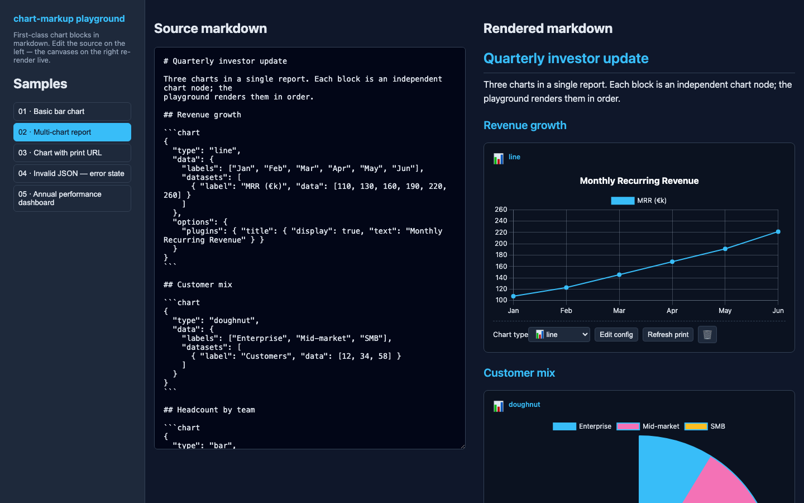
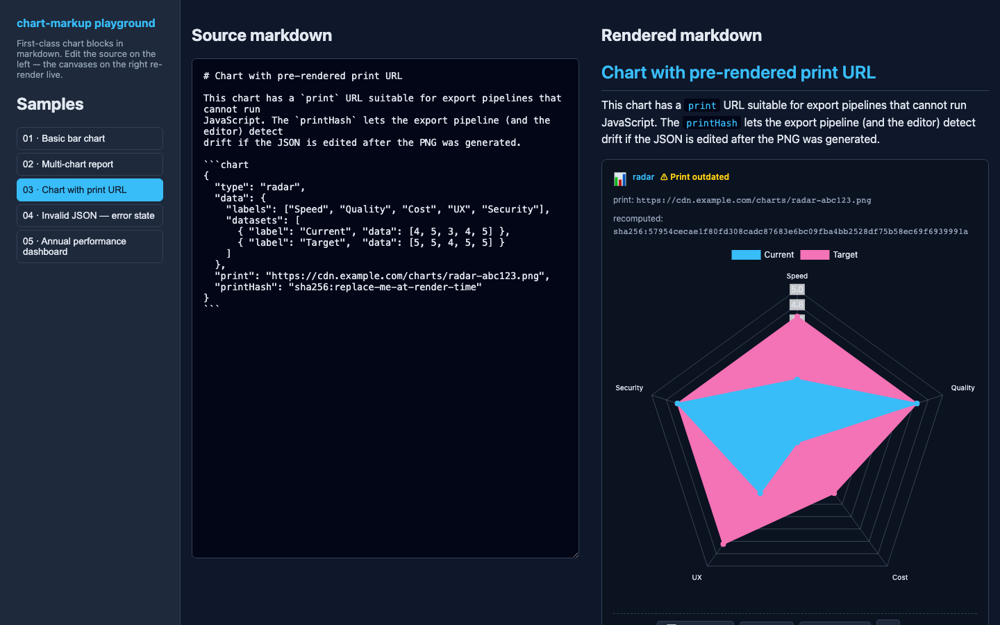
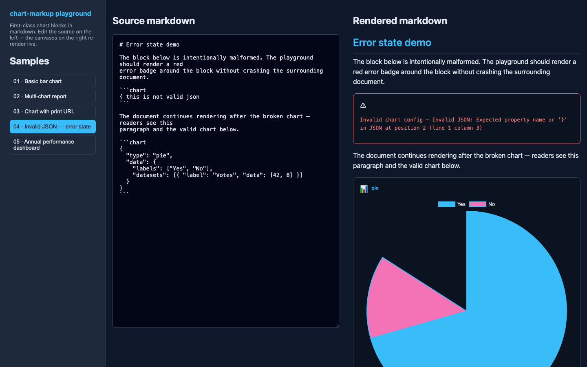
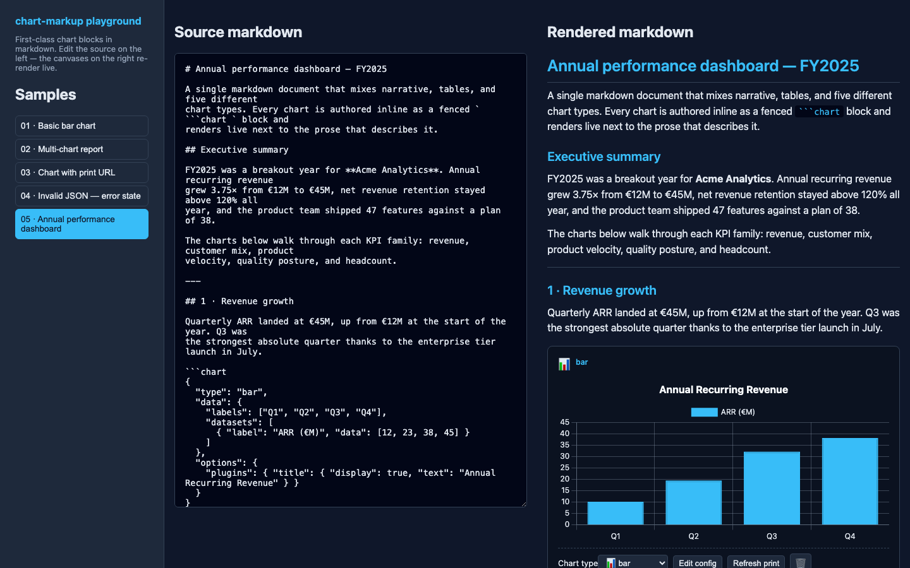
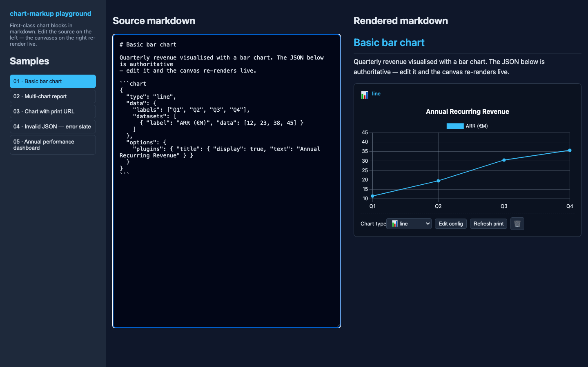

# Chart Markup — Visual E2E Proof

This document is a **reproducible visual proof** that every capability of the
`milkdown-plugin-chart-markup` first version actually works in a real browser.

All screenshots below are captured automatically by
[`proof-screenshots.spec.ts`](./proof-screenshots.spec.ts) — a Playwright spec
that boots the Vite playground, clicks each sample, waits for Chart.js to
paint, asserts the expected DOM invariants, and writes the PNGs into
[`./screenshots/`](./screenshots/).

Re-run the proof locally with:

```bash
pnpm --filter chart-markup-e2e exec playwright test proof-screenshots.spec.ts
```

Every shot pairs the authoritative markdown source (left panel) with its
live-rendered canvas (right panel). What you see on disk is exactly what the
test actually saw.

---

## 1 · Basic bar chart renders from fenced markdown

Sample: [`samples/01-basic-bar.md`](../../samples/01-basic-bar.md)
Assertion: `chart-0` is a canvas with `data-chart-type="bar"`.


---

## 2 · Three independent charts in one document

Sample: [`samples/02-multi-chart-report.md`](../../samples/02-multi-chart-report.md)
Assertion: `chart-0` is `line`, `chart-1` is `doughnut`, `chart-2` is `bar`,
all three canvases mounted.



---

## 3 · Drift detection — `printHash` mismatch surfaces the badge

Sample: [`samples/03-with-print-url.md`](../../samples/03-with-print-url.md)
The stored hash is `sha256:replace-me-at-render-time` but the config's real
hash is `sha256:57954cecae...9991a`, so the editor surfaces a yellow
`⚠ Print outdated` badge in the header.

Assertion: `chart-0-drift` badge is visible.



---

## 4 · Invalid JSON renders inline and the rest of the document still works

Sample: [`samples/04-invalid-json.md`](../../samples/04-invalid-json.md)
An intentionally broken fenced block appears first. The plugin renders a red
`Invalid chart config` banner in place of the canvas **and keeps going** —
the valid pie chart underneath still paints normally.

Assertion: `chart-0` has class `chart-markup-invalid`, `chart-1` canvas is visible.



---

## 6 · Annual performance dashboard — five charts interleaved with prose

Sample: [`samples/05-annual-dashboard.md`](../../samples/05-annual-dashboard.md)

A single markdown document mixing narrative, headings, lists, a blockquote,
and **five** different chart types (bar, line, doughnut, radar, grouped bar).
Each chart is authored inline as a fenced ` ```chart ` block and the right
column renders the entire document in source order: heading → prose → chart →
prose → chart → prose → chart… This is the real end-to-end proof that the
plugin composes into a full document flow, not just a grid of isolated
canvases.

Assertion: `chart-0` is `bar`, `chart-1` is `line`, `chart-2` is `doughnut`,
`chart-3` is `radar`, `chart-4` is `bar`.



---

## 5 · Live editing the source re-renders the canvas

Starting from `samples/01-basic-bar.md`, the test rewrites `"type": "bar"` to
`"type": "line"` directly in the source textarea. The canvas re-parses the
JSON on the next React render and flips to a line chart without any page
reload.

Assertion: after the textarea fill, `chart-0` has `data-chart-type="line"`.



---

## How the proof is structured

| File | Purpose |
|---|---|
| [`proof-screenshots.spec.ts`](./proof-screenshots.spec.ts) | Playwright spec that drives the playground and captures the PNGs |
| [`screenshots/*.png`](./screenshots/) | Captured frames, committed alongside the spec so the proof works offline |
| [`playground.spec.ts`](./playground.spec.ts) | The 7 hand-to-hand invariant tests that run on every CI pass |
| [`e2e-proof.md`](./e2e-proof.md) | This document — human-readable narrative around the captured frames |

Running `pnpm test:e2e` from the repo root runs both `playground.spec.ts`
**and** `proof-screenshots.spec.ts`, so the screenshots are regenerated every
time the e2e suite runs and drift from the code is impossible.
